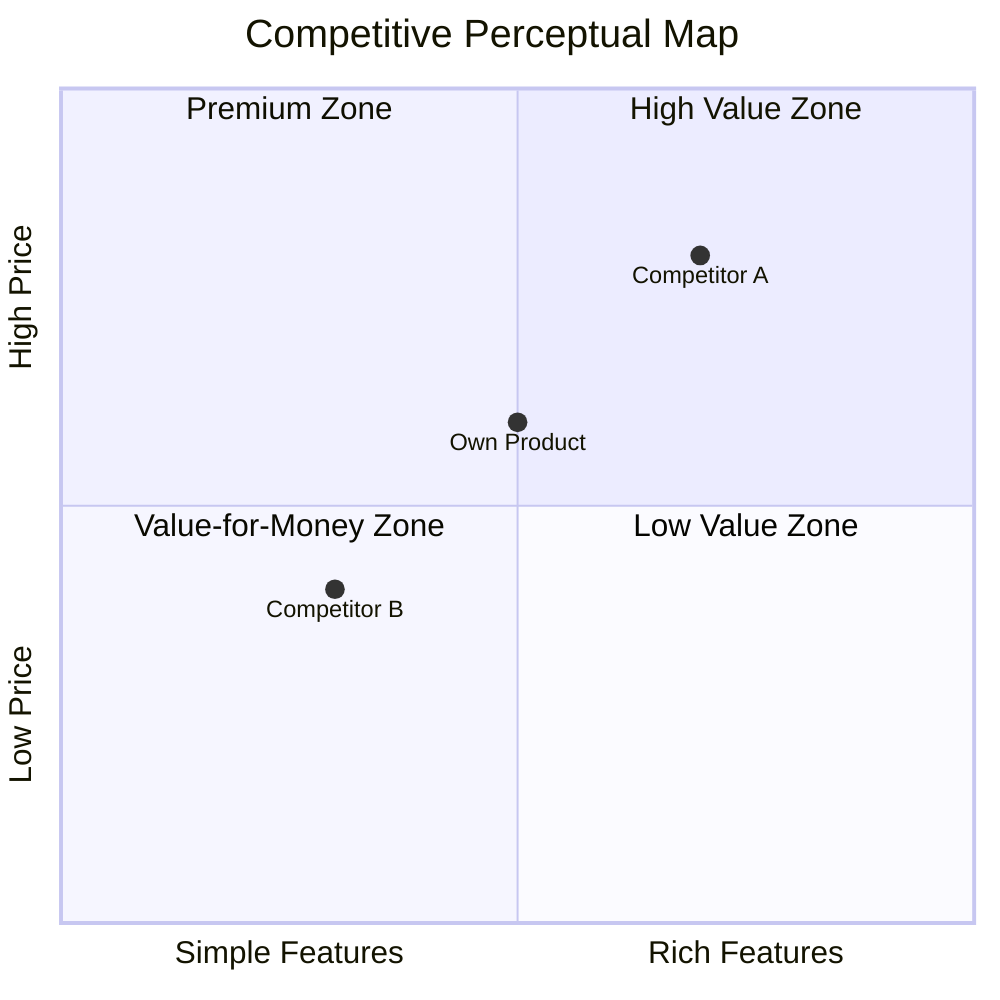

# market-competitor-analysis Examples & Execution Details

> This document is split from the market-competitor-analysis SKILL.md and contains the report structure template, perceptual map example, four-quadrant data source tables, and detailed execution step tables.

## Report Structure Template

```
# {Category} Competitive Analysis Report

## Executive Summary
- One-paragraph summary of competitive landscape
- 3 core findings
- Top 1 strategy recommendation

## 1. Market Overview
- Market size (TAM/SAM/SOM)
- Growth trends and drivers
- Macro environment impact (PEST key factors)

## 2. Competitive Landscape
- Four-quadrant classification overview
- Market share estimation
- Market concentration assessment

## 3. Competitor Deep Analysis
### 3.1 {Competitor A Name}
- Product profile
- SWOT analysis
- Moat assessment
### 3.2 {Competitor B Name}
- ...

## 4. Feature Matrix Comparison
- Core feature comparison table
- Differentiated feature annotation
- Feature coverage score

## 5. User Reputation Comparison
- Sentiment distribution comparison
- Top pain point horizontal comparison
- Differentiation opportunity identification

## 6. Pricing Strategy Comparison
- Price range comparison
- Plan structure comparison
- Value-for-money assessment

## 7. Competitive Perceptual Map
- Perceptual Map
- Positioning blank area analysis

## 8. Differentiation Strategy Recommendations
- Strategy 1: {name}
- Strategy 2: {name}
- Strategy 3: {name}

## Appendix
- Data source list
- Confidence annotation
- Analysis methodology description
```

## Perceptual Map Output (Mermaid)



## Direct Competitor Data Sources

| Data Source | Collection Content | Reliability |
|--------|---------|--------|
| App store categories | Product list under same category | High |
| Product directories (e.g., G2/Capterra) | Same category product comparison list | High |
| SEO competitor analysis | Competitors bidding on same keywords | Medium |
| Industry associations/databases | Industry members/certified products | High |

## Indirect Competitor Data Sources

| Data Source | Collection Content | Reliability |
|--------|---------|--------|
| User feedback alternatives | Alternative products mentioned in user reviews | Medium |
| Search term association analysis | Associated search terms for category keywords | Medium |
| Scenario mapping analysis | Products with different solutions for the same scenario | Medium |
| Community/forum discussions | Alternative recommendations in user discussions | Medium |

## Substitute Data Sources

| Data Source | Collection Content | Reliability |
|--------|---------|--------|
| User interview data | Current solutions described by users | High |
| Surveys | Alternatives chosen by users | High |
| Forums/communities | DIY solutions, manual process discussions | Medium |
| Industry reports | Non-productized solution proportions in the industry | Medium |

## Potential Competitor Data Sources

| Data Source | Collection Content | Reliability |
|--------|---------|--------|
| Job postings | Relevant technology/market position hiring | Low-Medium |
| Patent databases | Relevant technology patent applications | Medium |
| Financing info | Funding events in relevant fields | Medium |
| Strategic announcements | Relevant directions mentioned in company strategy | Low-Medium |
| Value chain analysis | Upstream/downstream enterprise extension capabilities | Low |

## SWOT Cross-Strategy Matrix

| Cross | Strategy Type | Description |
|------|---------|------|
| S+O | Growth strategy | Use strengths to seize opportunities |
| W+O | Improvement strategy | Fix weaknesses to seize opportunities |
| S+T | Defensive strategy | Use strengths to defend against threats |
| W+T | Crisis plan | Response when weaknesses meet threats |

## Competitive Moat Assessment

| Moat Type | Assessment Dimension | Scoring Standard |
|-----------|---------|---------|
| Network effects | Whether user growth enhances product value | 0-5 scale |
| Switching cost | Cost for users to migrate to competitors | 0-5 scale |
| Scale economy | Whether scale brings cost advantages | 0-5 scale |
| Brand barrier | Brand awareness and trust | 0-5 scale |
| Technology barrier | Replicability of core technology | 0-5 scale |
| Data barrier | Irreplaceability of data accumulation | 0-5 scale |
| Ecosystem barrier | Partners and integration ecosystem | 0-5 scale |

**Moat depth rating:**
- Total score ≥ 25: Deep moat (hard to shake)
- Total score 15-24: Medium moat (room for breakthrough)
- Total score < 15: Shallow moat (easy to enter)

## Market Share Estimation Methods

| Estimation Method | Applicable Conditions | Data Sources |
|----------|---------|---------|
| Top-down | Has TAM data and public market share | Industry reports + TAM data |
| Bottom-up | Has user count/revenue data for each competitor | Competitor public data |
| Relative share | Only qualitative comparison available | AI inference based on multi-source signals |

**Market concentration assessment:**
- HHI index calculation (Herfindahl-Hirschman Index)
- HHI < 1500: Fragmented competition / 1500-2500: Moderately concentrated / > 2500: Highly concentrated

## Differentiation Strategy Derivation

| Analysis Input | Strategy Direction |
|----------|---------|
| Common competitor pain points | Pain point breakthrough strategy: solve core problems none of the competitors solve |
| Competitors with shallow moats | Flank breakthrough strategy: enter from the competitor with the weakest moat |
| Blank areas in perceptual map | Positioning blank strategy: occupy positioning space not covered by competitors |
| SWOT cross matrix | Leverage strategy: use own strengths to seize opportunities exposed by competitor weaknesses |
| Fragmented market landscape | Focus strategy: focus deeply on one segment in a fragmented market |

## Perceptual Map Dimension Selection

| Category Characteristic | Recommended X Axis | Recommended Y Axis |
|----------|----------|----------|
| General | Feature richness | Ease of use |
| Enterprise | Feature completeness | Price |
| Consumer | User experience | Value for money |
| Technical | Technology advancement | Ecosystem maturity |
| Vertical | Vertical depth | Horizontal coverage |

## Inter-Quadrant Flow Annotation

| Flow Type | Trigger Signal | Estimated Timeline |
|---------|---------|-----------|
| Indirect → Direct | Indirect competitor launches same category product line, feature convergence | 6-18 months |
| Potential → Direct | Potential competitor officially launches similar product, completes market validation | 12-24 months |
| Potential → Indirect | Potential competitor launches differentiated solution targeting same scenario | 6-12 months |
| Substitute → Indirect | Non-productized approach becomes productized (e.g., tool-ification, platform-ification) | 12-36 months |

## Competitor Profile Construction

| Profile Dimension | Data Source | Description |
|----------|---------|------|
| Product positioning | Step 1 / User-provided | One-sentence positioning, target users, core value proposition |
| Feature matrix | Step 1 → feature_matrix | Feature coverage comparison, annotate differentiated features |
| User reputation | Step 1 → reputation | Sentiment distribution, top pain points, user migration signals |
| Pricing strategy | Step 1 → pricing | Price range, plan structure, value-for-money assessment |
| Business model | User-provided / AI-inferred | Revenue model, acquisition approach, growth strategy |
| Team and financing | User-provided / AI-inferred | Team size, funding rounds, cash reserves |
| Strategic direction | Step 1 → strategic_signals | Inferred strategic focus and confidence |
