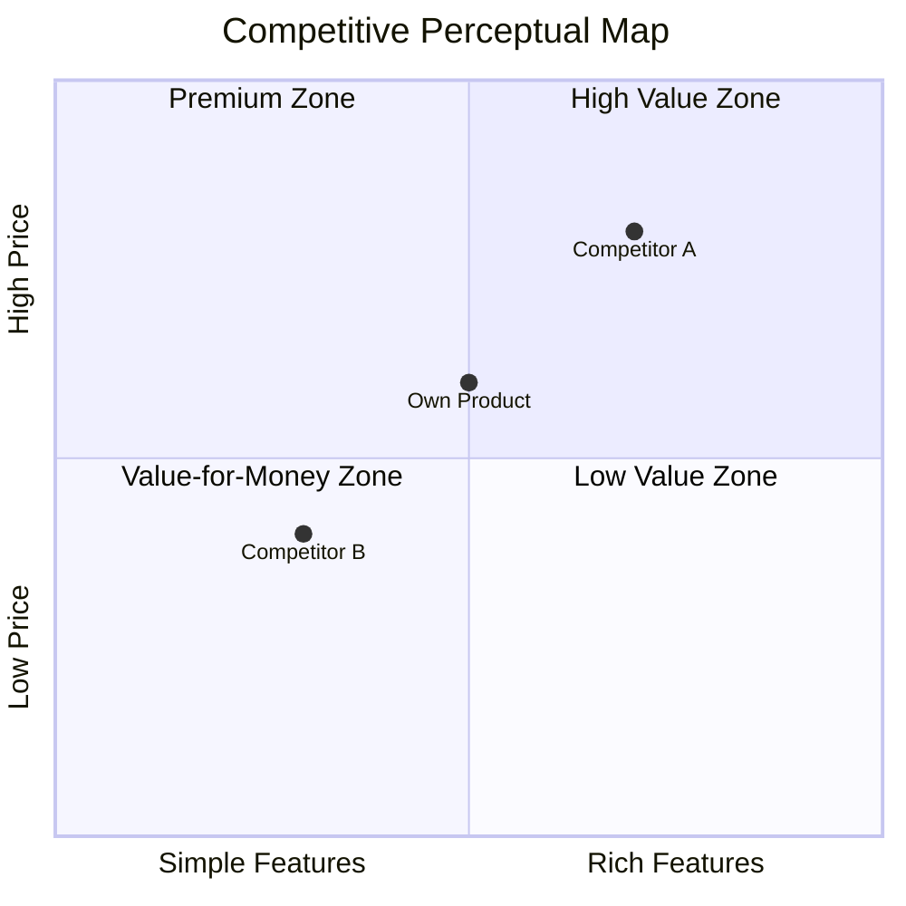

# Comprehensive Competitive Analysis

## Core Principles

1. **Multi-source cross-validation** — Competitor intelligence from a single source is unreliable. Each key finding must be cross-validated by at least 2 independent sources. Strategy inference confidence is highest when hiring, financing, and feature update signals converge.
2. **Change is signal** — Every competitor feature change, pricing adjustment, and hiring change is a strategic signal, not an isolated event. They must be interpreted in context, not simply listed.
3. **Tiered alert response** — P0 (impact ≥ 5) urgent notification + mark as needing urgent response; P1 (impact = 4) immediate notification + include in weekly report; P2 (impact < 4) only in weekly report. Resource allocation matches impact degree.
4. **Strategy inference confidence annotation** — Hiring-inferred strategic direction confidence 0.5-0.7; financing + hiring dual signal 0.7-0.9; official announcement 0.9+. Low-confidence inferences must be escalated for human validation.
5. **Four-quadrant definition first** — Direct/indirect/substitute/potential four quadrants have strict definitions (same category + same users + same features / same scenario + different solutions / non-productized approaches / capable of entering). Classification must be based on definitions, not intuition.
6. **Inter-quadrant flow traceable** — Competitors are not statically assigned to a quadrant. Indirect competitors may upgrade to direct, potential competitors may become direct. Annotate flow signals and estimated timeline.
7. **Potential competitors default to validation** — Every item in the potential competitor quadrant defaults to needs_human_validation=true, because potential competitor identification is based on inferred signals (hiring/patents/financing) with the highest uncertainty.
8. **Empty quadrant is a risk signal** — An empty quadrant is not "no competitors" but "no competitors identified". Must annotate the quadrant as needing supplementation, suggest user provide leads.
9. **Data-driven conclusions first** — Every conclusion must be supported by data or evidence. Unsupported inferences are prohibited.
10. **Structured output deliverable** — Reports are for decision makers, not for AI. Readability first.
11. **Insight over data piling** — Data is the means, insight is the purpose. Every piece of data must answer "so what".
12. **Actionable recommendations** — Strategic recommendations must be specific to "what to do + why + expected effect".

## Interaction Mode

🤖→👤 AI suggests, human approves

## Inputs

| Input Item | Type | Required | Source | Description |
|--------|------|------|------|------|
| competitor_list | array | Yes | User-provided | Competitor list, each item contains name, category, official website URL |
| category_keywords | string | Yes | User-provided | Category keywords, e.g., "online education", "SaaS CRM" |
| monitor_config | object | No | User-provided | Monitoring config, including scan frequency, focus dimensions, alert thresholds |
| Market size data | JSON | ○ | docs/discovery/market-analysis.md ("Market Size" section) | TAM/SAM/SOM and growth rate |
| Macro environment data | JSON | ○ | docs/discovery/market-analysis.md ("PEST Analysis" section) | PEST four-dimension trends |
| Own product info | string/markdown | ○ | User-provided | Own product positioning, core features, target users, current status |

## Execution Steps

### Step 1: Competitor Intelligence Collection [Core]

Multi-source information collection, covering all-around competitor dynamics:

| Collection Source | Collection Content | Collection Frequency |
|--------|---------|---------|
| App version update monitoring | Version number, release notes, feature changes, release time | Each version release |
| Official website/blog updates | Product page changes, new feature announcements, strategy articles, pricing page changes | Daily |
| App review collection | User ratings, review content, sentiment, high-frequency keywords | Weekly |
| Pricing page monitoring | Price changes, plan adjustments, promotional activities, new pricing models | Daily |
| Job posting monitoring | New positions, position count changes, tech stack requirements, geographic distribution | Weekly |
| Industry news/financing info | Funding rounds and amounts, strategic partnerships, M&A, industry rankings | Real-time |

**Job posting strategy inference rules:**
- Mass hiring for a specific tech stack position → infer technology direction investment
- New overseas positions → infer internationalization strategy
- Sharp drop in hiring volume → infer cost contraction or strategic adjustment
- New AI/ML positions → infer intelligence direction

#### Feature Matrix Auto-Update [Conditional]

| Step | Description |
|------|------|
| Detect version updates | Get version update info from collection layer |
| Extract feature changes | Parse release notes, extract added/upgraded/removed features |
| Compare with existing matrix | Compare with Feature Matrix, annotate change type |
| Assess impact degree | 1-5 scale assessment of impact on competitive landscape |
| Trigger alert | Real-time alert when impact degree ≥ 4 |

**Change type definitions:**
- Added: Competitor adds a feature it previously lacked
- Upgraded: Competitor makes major improvements to existing features
- Removed: Competitor takes down a feature
- Downgraded: Competitor limits or downgrades an existing feature

#### Competitor User Reputation Comparison [Conditional]

| Analysis Dimension | Description |
|---------|------|
| Sentiment distribution comparison | Compare positive/neutral/negative sentiment ratios across competitors |
| High-frequency pain point comparison | Extract top pain points for each competitor, compare horizontally |
| Differentiation opportunities | Identify common competitor pain points, mark as differentiation opportunities |
| Competitive disadvantage warning | Identify reputation disadvantages of own product vs competitors |
| User migration signals | Detect reviews expressing dissatisfaction or migration intent from competitor users |

#### Pricing Strategy Comparison [Conditional]

| Analysis Dimension | Description |
|---------|------|
| Price range comparison | Compare pricing ranges and average prices across competitors |
| Plan structure comparison | Compare free/basic/pro/enterprise feature distribution |
| Pricing model changes | Detect pricing model changes (e.g., usage-based → subscription) |
| Value-for-money assessment | Compare feature coverage/price ratio |

#### Feature Update Interpretation [Deep]

- Strategic intent interpretation of feature changes
- Impact assessment on user value
- Impact assessment on competitive landscape
- Recommended response measures

#### Strategic Direction Inference [Deep]

Synthesize hiring, financing, feature updates, pricing changes and other multi-source signals to infer competitor strategic direction:
- Market expansion / contraction direction
- Technology investment direction
- Target audience migration direction
- Business model evolution direction

### Step 2: Four-Quadrant Positioning [Core]

#### Direct Competitor Identification

**Definition:** Same category + same target users + same core features

**Identification logic:**
1. Filter competitors from the known list with exact category matches
2. Search app stores for products in the same category based on category keywords
3. Search product directories/industry databases for similar products
4. SEO competitor analysis (competitors bidding on the same core keywords)

**Data sources:**

| Data Source | Collection Content | Reliability |
|--------|---------|--------|
| App store categories | Product list under same category | High |
| Product directories (e.g., G2/Capterra) | Same category product comparison list | High |
| SEO competitor analysis | Competitors bidding on same keywords | Medium |
| Industry associations/databases | Industry members/certified products | High |

#### Indirect Competitor Identification

**Definition:** Same user scenario + different solutions

**Identification logic:**
1. Analyze target user scenarios, list all possible solution approaches
2. Extract alternative products mentioned in user feedback
3. Search term analysis: other products users search for when searching category keywords
4. Identify products that solve the same scenario but with different technology paths/business models

**Data sources:**

| Data Source | Collection Content | Reliability |
|--------|---------|--------|
| User feedback alternatives | Alternative products mentioned in user reviews | Medium |
| Search term association analysis | Associated search terms for category keywords | Medium |
| Scenario mapping analysis | Products with different solutions for the same scenario | Medium |
| Community/forum discussions | Alternative recommendations in user discussions | Medium |

#### Substitute Identification

**Definition:** Users' current non-productized solutions

**Identification logic:**
1. Identify target users' solutions when this category of product is unavailable
2. Extract current workflows/manual processes from user interview data
3. Collect non-productized alternatives from surveys
4. Extract DIY solutions/manual processes from forums/community discussions

**Data sources:**

| Data Source | Collection Content | Reliability |
|--------|---------|--------|
| User interview data | Current solutions described by users | High |
| Surveys | Alternatives chosen by users | High |
| Forums/communities | DIY solutions, manual process discussions | Medium |
| Industry reports | Non-productized solution proportions in the industry | Medium |

#### Potential Competitor Identification

**Definition:** Companies capable of entering this field

**Identification logic:**
1. Job posting monitoring: detect hiring for relevant technology/market positions
2. Patent analysis: search patent applications in relevant technology fields
3. Financing info: track companies receiving funding in relevant fields
4. Strategic announcements: analyze relevant directions mentioned in company strategies

**Data sources:**

| Data Source | Collection Content | Reliability |
|--------|---------|--------|
| Job postings | Relevant technology/market position hiring | Low-Medium |
| Patent databases | Relevant technology patent applications | Medium |
| Financing info | Funding events in relevant fields | Medium |
| Strategic announcements | Relevant directions mentioned in company strategy | Low-Medium |
| Value chain analysis | Upstream/downstream enterprise extension capabilities | Low |

#### Confidence Assessment and Human Validation Annotation [Conditional]

Assess confidence for each competitor item in each quadrant:

| Assessment Dimension | Description |
|---------|------|
| Data source reliability | Credibility of data source (0-1) |
| Evidence sufficiency | Quantity and quality of evidence supporting this classification |
| Classification certainty | Degree of certainty in assigning this competitor to this quadrant |

**Confidence tiers:**
- High (0.8-1.0): Multi-source cross-validation, classification certain
- Medium (0.5-0.8): Data-supported but single source or partially contradictory
- Low (<0.5): Inferential conclusion, needs human validation

#### Inter-Quadrant Flow Annotation [Deep]

Assess inter-quadrant flow possibility for identified competitors:

| Flow Type | Trigger Signal | Estimated Timeline |
|---------|---------|-----------|
| Indirect → Direct | Indirect competitor launches same category product line, feature convergence | 6-18 months |
| Potential → Direct | Potential competitor officially launches similar product, completes market validation | 12-24 months |
| Potential → Indirect | Potential competitor launches differentiated solution targeting same scenario | 6-12 months |
| Substitute → Indirect | Non-productized approach becomes productized (e.g., tool-ification, platform-ification) | 12-36 months |

**Flow annotation rules:**
- Each competitor item may optionally fill in `flow_signal` (flow signal description) and `estimated_flow_timeline` (estimated flow timeline)
- Only annotate flow when there are clear signals; do not fill if no signals
- Flow signals must include data source

### Step 3: Competitive Analysis Report [Core]

#### Data Integration and Competitor Profile Construction

Integrate Step 1 and Step 2 data, build a complete profile for each core competitor:

| Profile Dimension | Data Source | Description |
|----------|---------|------|
| Product positioning | Step 1 / User-provided | One-sentence positioning, target users, core value proposition |
| Feature matrix | Step 1 → feature_matrix | Feature coverage comparison, annotate differentiated features |
| User reputation | Step 1 → reputation | Sentiment distribution, top pain points, user migration signals |
| Pricing strategy | Step 1 → pricing | Price range, plan structure, value-for-money assessment |
| Business model | User-provided / AI-inferred | Revenue model, acquisition approach, growth strategy |
| Team and financing | User-provided / AI-inferred | Team size, funding rounds, cash reserves |
| Strategic direction | Step 1 → strategic_signals | Inferred strategic focus and confidence |

**Competitor filtering rules:**
- Deep profile count: 3-5 core competitors (direct competitors prioritized)
- When exceeding 5, sort by threat level and take Top 5
- Indirect/substitute competitors: take 1-2 representative cases each

#### SWOT Analysis (per competitor) [Conditional]

Generate SWOT analysis for each core competitor:

**Strengths**:
- Extract features unique to or leading for this competitor from feature_matrix
- Extract dimensions with concentrated positive reviews from reputation
- Extract pricing advantages from pricing

**Weaknesses**:
- Extract high-frequency pain points from reputation.top_pain_points
- Extract missing features from feature_matrix
- Extract value-for-money disadvantages from pricing

**Opportunities**:
- Common pain points in competitor reputation → own differentiation opportunities
- Blank areas in competitor strategic direction
- Uncovered segments in market growth

**Threats**:
- Features competitors are about to launch (inferred from strategic_signals)
- Competitor price cuts or free-ization trends
- Potential competitor entry signals

**SWOT cross-strategy matrix**:

| Cross | Strategy Type | Description |
|------|---------|------|
| S+O | Growth strategy | Use strengths to seize opportunities |
| W+O | Improvement strategy | Fix weaknesses to seize opportunities |
| S+T | Defensive strategy | Use strengths to defend against threats |
| W+T | Crisis plan | Response when weaknesses meet threats |

#### Perceptual Map [Conditional]

Draw a perceptual map based on two core dimensions:

**Dimension selection rules:**
- Prioritize the 2 dimensions users care most about when making decisions
- Common dimension combinations:

| Category Characteristic | Recommended X Axis | Recommended Y Axis |
|----------|----------|----------|
| General | Feature richness | Ease of use |
| Enterprise | Feature completeness | Price |
| Consumer | User experience | Value for money |
| Technical | Technology advancement | Ecosystem maturity |
| Vertical | Vertical depth | Horizontal coverage |

**Perceptual map output** (Mermaid quadrant chart):


#### Competitive Moat Assessment [Deep]

Assess the moat depth of each competitor:

| Moat Type | Assessment Dimension | Scoring Standard |
|-----------|---------|---------|
| Network effects | Whether user growth enhances product value | 0-5 scale |
| Switching cost | Cost for users to migrate to competitors | 0-5 scale |
| Scale economy | Whether scale brings cost advantages | 0-5 scale |
| Brand barrier | Brand awareness and trust | 0-5 scale |
| Technology barrier | Replicability of core technology | 0-5 scale |
| Data barrier | Irreplaceability of data accumulation | 0-5 scale |
| Ecosystem barrier | Partners and integration ecosystem | 0-5 scale |

**Moat depth rating:**
- Total score ≥ 25: Deep moat (hard to shake)
- Total score 15-24: Medium moat (room for breakthrough)
- Total score < 15: Shallow moat (easy to enter)

#### Market Share Estimation [Deep]

Estimate the competitive landscape based on available data:

| Estimation Method | Applicable Conditions | Data Sources |
|----------|---------|---------|
| Top-down | Has TAM data and public market share | Industry reports + TAM data |
| Bottom-up | Has user count/revenue data for each competitor | Competitor public data |
| Relative share | Only qualitative comparison available | AI inference based on multi-source signals |

**Market concentration assessment:**
- HHI index calculation (Herfindahl-Hirschman Index)
- HHI < 1500: Fragmented competition / 1500-2500: Moderately concentrated / > 2500: Highly concentrated

#### Differentiation Strategy Recommendations [Conditional]

Based on prior analysis, generate differentiation strategy recommendations:

**Strategy derivation logic:**

| Analysis Input | Strategy Direction |
|----------|---------|
| Common competitor pain points | Pain point breakthrough strategy: solve core problems none of the competitors solve |
| Competitors with shallow moats | Flank breakthrough strategy: enter from the competitor with the weakest moat |
| Blank areas in perceptual map | Positioning blank strategy: occupy positioning space not covered by competitors |
| SWOT cross matrix | Leverage strategy: use own strengths to seize opportunities exposed by competitor weaknesses |
| Fragmented market landscape | Focus strategy: focus deeply on one segment in a fragmented market |

**Each strategy includes:**
- Strategy name and one-sentence description
- Strategy basis (citing specific analysis data)
- Expected effect
- Risks and prerequisites
- Priority (P0/P1/P2)

#### Report Assembly

Integrate all analysis into a complete Markdown report:

**Report structure:**

```
# {Category} Competitive Analysis Report

## Executive Summary
- One-paragraph summary of competitive landscape
- 3 core findings
- Top 1 strategy recommendation

## 1. Market Overview
- Market size (TAM/SAM/SOM)
- Growth trends and drivers
- Macro environment impact (PEST key factors)

## 2. Competitive Landscape
- Four-quadrant classification overview
- Market share estimation
- Market concentration assessment

## 3. Competitor Deep Analysis
### 3.1 {Competitor A Name}
- Product profile
- SWOT analysis
- Moat assessment
### 3.2 {Competitor B Name}
- ...

## 4. Feature Matrix Comparison
- Core feature comparison table
- Differentiated feature annotation
- Feature coverage score

## 5. User Reputation Comparison
- Sentiment distribution comparison
- Top pain point horizontal comparison
- Differentiation opportunity identification

## 6. Pricing Strategy Comparison
- Price range comparison
- Plan structure comparison
- Value-for-money assessment

## 7. Competitive Perceptual Map
- Perceptual Map
- Positioning blank area analysis

## 8. Differentiation Strategy Recommendations
- Strategy 1: {name}
- Strategy 2: {name}
- Strategy 3: {name}

## Appendix
- Data source list
- Confidence annotation
- Analysis methodology description
```

## Output

**Storage path**: `docs/discovery/market-analysis.md ("Competitive Analysis" section)`

**Output files:**

| File | Format | Description |
|------|------|------|
| competitor-analysis.json | JSON | Structured data (including intel data + quadrant data + report summary) |
| competitor-analysis.md | Markdown | Complete competitive analysis report |

**competitor-analysis.json Output Schema**:

```json
{
  "type": "object",
  "required": ["scan_timestamp", "competitors", "quadrants", "executive_summary", "competitor_profiles", "differentiation_strategies"],
  "properties": {
    "scan_timestamp": {"type": "string", "description": "Scan timestamp"},
    "competitors": {"type": "array", "description": "Competitor intelligence list, including Feature Matrix, reputation, pricing, and strategic signals"},
    "reputation_comparison": {"type": "object", "description": "Competitor reputation cross-comparison"},
    "alerts": {"type": "array", "description": "Competitor change alert list"},
    "category_keywords": {"type": "string", "description": "Category keywords"},
    "quadrants": {"type": "object", "description": "Four-quadrant competitor classification, including direct/indirect/substitute/potential competitors"},
    "quadrant_summary": {"type": "object", "description": "Four-quadrant classification statistics summary"},
    "report_metadata": {"type": "object", "description": "Report metadata, including category, timestamp, and confidence"},
    "executive_summary": {"type": "object", "description": "Executive summary, including competitive landscape summary and core findings"},
    "market_overview": {"type": "object", "description": "Market overview, including TAM/SAM/SOM and growth trends"},
    "competitive_landscape": {"type": "object", "description": "Competitive landscape, including four-quadrant summary and market share estimation"},
    "competitor_profiles": {"type": "array", "description": "Competitor deep profile list, including SWOT and moat assessment"},
    "feature_matrix_summary": {"type": "object", "description": "Feature matrix comparison summary"},
    "perceptual_map": {"type": "object", "description": "Competitive perceptual map data"},
    "differentiation_strategies": {"type": "array", "description": "Differentiation strategy recommendation list"}
  }
}
```

### Output Validation Rules

| Field Path | Type | Required | Description |
|---------|------|------|------|
| scan_timestamp | string | Yes | ISO 8601 format timestamp, cannot be empty or future time |
| competitors | array | Yes | At least 1 competitor entry, each must contain name and category |
| competitors[].feature_matrix | object | Yes | Must include features array and last_updated timestamp |
| competitors[].feature_matrix.features | array | Yes | Each item must contain feature_name, status, impact_degree, source |
| competitors[].feature_matrix.features[].impact_degree | integer | Yes | Value 1-5, must be integer |
| competitors[].feature_matrix.features[].source | string | Yes | Data source cannot be empty; key findings must annotate ≥ 2 independent sources |
| competitors[].reputation | object | Yes | Must include sentiment_distribution, top_pain_points, data_sources |
| competitors[].reputation.sentiment_distribution | object | Yes | Sum of positive+neutral+negative must be 1.0 (±0.01 tolerance) |
| competitors[].reputation.data_sources | array | Yes | At least 1 reputation data source annotated |
| competitors[].pricing | object | Yes | Must include price_range, plan_structure, value_score |
| competitors[].pricing.value_score | number | Yes | Value 0.0-1.0, two decimal places |
| competitors[].strategic_signals | object | Yes | Must include direction, confidence, evidence, needs_human_validation |
| competitors[].strategic_signals.confidence | number | Yes | Value 0.0-1.0; when < 0.5, needs_human_validation must be true |
| competitors[].strategic_signals.evidence | array | Yes | At least 1 piece of evidence, each must annotate source type and confidence |
| competitors[].strategic_signals.needs_human_validation | boolean | Yes | Must be true when confidence < 0.5 or only single-source inference |
| reputation_comparison | object | No | Required when competitors count ≥ 2; must include common_pain_points, differentiation_opportunities |
| reputation_comparison.common_pain_points | array | No | Each item must contain pain point description and involved competitor list |
| reputation_comparison.differentiation_opportunities | array | No | Each item must contain opportunity description and associated common competitor pain points |
| reputation_comparison.competitive_disadvantages | array | No | Each item must contain disadvantage description and comparison competitor name |
| alerts | array | No | Changes with impact degree ≥ 4 must generate an alert entry |
| alerts[].impact_degree | integer | Yes | Value 1-5; ≥ 4 must trigger notification mechanism |
| alerts[].recommendation | string | Yes | Response recommendation cannot be empty; must be a specific actionable recommendation |
| alerts[].timestamp | string | Yes | ISO 8601 format timestamp, cannot be empty |
| category_keywords | string | Yes | Category keywords, cannot be an empty string |
| quadrants | object | Yes | Four-quadrant container, must include all four sub-quadrants |
| quadrants.direct_competitors | object | Yes | Direct competitor quadrant, definition cannot be empty |
| quadrants.direct_competitors.items | array | Yes | Direct competitor list, can be empty array but must annotate as needing supplementation |
| quadrants.direct_competitors.items[].name | string | Yes | Competitor name, cannot be empty |
| quadrants.direct_competitors.items[].confidence | number | Yes | Confidence, range 0-1 |
| quadrants.direct_competitors.items[].data_source | string | Yes | Data source, cannot be empty |
| quadrants.direct_competitors.items[].needs_human_validation | boolean | Yes | Whether human validation is needed; must be true when confidence < 0.5 |
| quadrants.indirect_competitors | object | Yes | Indirect competitor quadrant, definition cannot be empty |
| quadrants.indirect_competitors.items | array | Yes | Indirect competitor list, can be empty array but must annotate as needing supplementation |
| quadrants.indirect_competitors.items[].name | string | Yes | Competitor name, cannot be empty |
| quadrants.indirect_competitors.items[].confidence | number | Yes | Confidence, range 0-1 |
| quadrants.indirect_competitors.items[].data_source | string | Yes | Data source, cannot be empty |
| quadrants.indirect_competitors.items[].needs_human_validation | boolean | Yes | Whether human validation is needed; must be true when confidence < 0.5 |
| quadrants.substitutes | object | Yes | Substitute quadrant, definition cannot be empty |
| quadrants.substitutes.items | array | Yes | Substitute list, can be empty array but must annotate as needing supplementation |
| quadrants.substitutes.items[].name | string | Yes | Substitute name, cannot be empty |
| quadrants.substitutes.items[].confidence | number | Yes | Confidence, range 0-1 |
| quadrants.substitutes.items[].data_source | string | Yes | Data source, cannot be empty |
| quadrants.substitutes.items[].needs_human_validation | boolean | Yes | Whether human validation is needed; must be true when confidence < 0.5 |
| quadrants.potential_competitors | object | Yes | Potential competitor quadrant, definition cannot be empty |
| quadrants.potential_competitors.items | array | Yes | Potential competitor list, can be empty array but must annotate as needing supplementation |
| quadrants.potential_competitors.items[].name | string | Yes | Competitor name, cannot be empty |
| quadrants.potential_competitors.items[].confidence | number | Yes | Confidence, range 0-1 |
| quadrants.potential_competitors.items[].data_source | string | Yes | Data source, cannot be empty |
| quadrants.potential_competitors.items[].needs_human_validation | boolean | Yes | Whether human validation is needed; **defaults to true** |
| quadrant_summary | object | Yes | Classification statistics summary |
| quadrant_summary.total_items | number | Yes | Total competitor count, should equal sum of four-quadrant items |
| quadrant_summary.by_confidence | object | Yes | Statistics by confidence tier |
| quadrant_summary.by_confidence.high | number | Yes | High-confidence item count (≥ 0.8) |
| quadrant_summary.by_confidence.medium | number | Yes | Medium-confidence item count (0.5-0.8) |
| quadrant_summary.by_confidence.low | number | Yes | Low-confidence item count (< 0.5) |
| quadrant_summary.needs_validation_count | number | Yes | Count of items needing human validation |
| report_metadata | object | Yes | Report metadata, must include category, generated_at, competitors_analyzed, data_sources, overall_confidence |
| report_metadata.category | string | Yes | Category keywords, cannot be empty |
| report_metadata.generated_at | string | Yes | ISO 8601 timestamp |
| report_metadata.competitors_analyzed | integer | Yes | Number of competitors analyzed, ≥ 3 |
| report_metadata.data_sources | array | Yes | Data source list, cannot be empty array |
| report_metadata.overall_confidence | number | Yes | Overall confidence, range 0.0-1.0 |
| executive_summary | object | Yes | Executive summary |
| executive_summary.competition_landscape | string | Yes | One-paragraph summary of competitive landscape, ≥ 50 characters |
| executive_summary.key_findings | array | Yes | Core findings list, length = 3 |
| executive_summary.top_strategy | string | Yes | Top 1 strategy recommendation, cannot be empty |
| market_overview | object | No | Market overview; when missing, annotate as "lacking market size data" |
| market_overview.tam | number | Conditional | Required when market_overview exists, > 0 |
| market_overview.sam | number | Conditional | Required when market_overview exists, > 0 and ≤ tam |
| market_overview.som | number | Conditional | Required when market_overview exists, > 0 and ≤ sam |
| market_overview.growth_rate | string | Conditional | Required when market_overview exists, format like "12.5%" |
| market_overview.key_drivers | array | Conditional | Required when market_overview exists, ≥ 1 item |
| market_overview.pest_highlights | array | No | PEST key factors; can be empty array when missing |
| competitive_landscape | object | No | Competitive landscape |
| competitive_landscape.quadrant_summary | object | Conditional | Required when competitive_landscape exists |
| competitive_landscape.market_share_estimate | array | Conditional | Required when competitive_landscape exists, ≥ 1 item |
| competitive_landscape.hhi_index | number | Conditional | Required when competitive_landscape exists, range 0-10000 |
| competitive_landscape.concentration_level | string | Conditional | Required when competitive_landscape exists, enum: fragmented/moderately concentrated/highly concentrated |
| competitor_profiles | array | Yes | Competitor deep profile list, length 3-5 |
| competitor_profiles[].name | string | Yes | Competitor name, cannot be empty |
| competitor_profiles[].positioning | string | Yes | One-sentence positioning, cannot be empty |
| competitor_profiles[].swot | object | Yes | SWOT analysis, must include strengths/weaknesses/opportunities/threats arrays, each array ≥ 1 item |
| competitor_profiles[].swot.strengths | array | Yes | Strengths list, ≥ 1 item |
| competitor_profiles[].swot.weaknesses | array | Yes | Weaknesses list, ≥ 1 item |
| competitor_profiles[].swot.opportunities | array | Yes | Opportunities list, ≥ 1 item |
| competitor_profiles[].swot.threats | array | Yes | Threats list, ≥ 1 item |
| competitor_profiles[].moat_score | object | Yes | Moat assessment |
| competitor_profiles[].moat_score.network_effects | number | Yes | Network effects score, 0-5 |
| competitor_profiles[].moat_score.switching_cost | number | Yes | Switching cost score, 0-5 |
| competitor_profiles[].moat_score.scale_economy | number | Yes | Scale economy score, 0-5 |
| competitor_profiles[].moat_score.brand | number | Yes | Brand barrier score, 0-5 |
| competitor_profiles[].moat_score.technology | number | Yes | Technology barrier score, 0-5 |
| competitor_profiles[].moat_score.data | number | Yes | Data barrier score, 0-5 |
| competitor_profiles[].moat_score.ecosystem | number | Yes | Ecosystem barrier score, 0-5 |
| competitor_profiles[].moat_score.total | number | Yes | Moat total score, = sum of 7 items, 0-35 |
| competitor_profiles[].moat_score.level | string | Yes | Moat depth, enum: deep/medium/shallow |
| feature_matrix_summary | object | No | Feature matrix comparison summary |
| feature_matrix_summary.total_features_compared | integer | Conditional | Required when feature_matrix_summary exists, > 0 |
| feature_matrix_summary.differentiation_features | array | Conditional | Required when feature_matrix_summary exists, ≥ 1 item |
| feature_matrix_summary.coverage_scores | object | Conditional | Required when feature_matrix_summary exists, coverage score for each competitor |
| perceptual_map | object | No | Competitive perceptual map data |
| perceptual_map.x_axis | string | Conditional | Required when perceptual_map exists, X axis dimension name |
| perceptual_map.y_axis | string | Conditional | Required when perceptual_map exists, Y axis dimension name |
| perceptual_map.positions | array | Conditional | Required when perceptual_map exists, ≥ 2 competitor coordinate points |
| perceptual_map.positions[].name | string | Yes | Competitor name |
| perceptual_map.positions[].x | number | Yes | X axis coordinate, 0.0-1.0 |
| perceptual_map.positions[].y | number | Yes | Y axis coordinate, 0.0-1.0 |
| perceptual_map.white_space | string | Conditional | Required when perceptual_map exists, blank area description |
| differentiation_strategies | array | Yes | Differentiation strategy recommendation list, ≥ 3 items |
| differentiation_strategies[].name | string | Yes | Strategy name, cannot be empty |
| differentiation_strategies[].description | string | Yes | One-sentence description, cannot be empty |
| differentiation_strategies[].evidence | string | Yes | Strategy basis, must cite specific analysis data |
| differentiation_strategies[].expected_impact | string | Yes | Expected effect, cannot be empty |
| differentiation_strategies[].risks | string | Yes | Risks and prerequisites, cannot be empty |
| differentiation_strategies[].priority | string | Yes | Priority, enum: P0/P1/P2 |

## Decision Rules

| Rule | Trigger Condition | Action |
|------|---------|------|
| P0 alert (auto-notification + urgent mark) | Feature change impact degree ≥ 5 | Immediate notification to human PM, mark as needing urgent response, do not wait for weekly report cycle |
| P1 alert (auto-notification) | Feature change impact degree 4 | Immediate notification to human PM, include in next weekly report detailed analysis |
| Strategy inference escalation | Competitor strategy inference confidence < 0.5 | Escalate to human judgment, mark as needing validation |
| Pricing change alert | Competitor pricing changes | Notify human PM of pricing change details and impact analysis |
| Reputation anomaly alert | Competitor reputation shows major fluctuation (sentiment distribution change > 15%) | Notify human PM of reputation change analysis |
| Potential competitor needs validation | Any item in potential competitor quadrant | Default needs_human_validation=true; confidence typically low, needs human confirmation |
| Quadrant minimum fill | Any quadrant empty | Annotate quadrant as needing supplementation, suggest user provide leads |
| Low confidence annotation | Confidence < 0.5 | Annotate as needing human validation, explain uncertainty reason |
| Core competitor count < 3 | Competitor deep analysis stage | Annotate as "insufficient competitor coverage", recommend supplementing competitors before generating report |
| Core competitor count > 7 | Competitor deep analysis stage | Sort by threat level, take Top 5 for deep analysis, rest in summary table |
| Insufficient moat assessment data | Moat assessment stage | Annotate confidence for each dimension, provide inference basis for low-confidence dimensions |
| No public market share data | Market share estimation stage | Use relative share estimation, explicitly annotate as "estimated value" and estimation method |
| Own product info missing | Differentiation strategy recommendation stage | Differentiation strategy recommendations annotated as "general recommendations", need adjustment based on own situation |
| PEST data missing | Market overview stage | Skip macro environment section in market overview, annotate as "lacking PEST data" |

## Quality Checks

- [ ] Feature Matrix updated, changes annotated with type and impact degree (P1)
- [ ] Competitor reputation comparison completed (P1)
- [ ] Differentiation opportunities identified (P0)
- [ ] Pricing strategy comparison completed (P1)
- [ ] Strategic direction inference completed, low confidence annotated (P2)
- [ ] Alerts triggered (changes with impact degree ≥ 4) (P0)
- [ ] Data sources annotated (P0)
- [ ] Key findings cross-validated by multiple sources (at least 2 independent sources) (P0)
- [ ] Four quadrants populated (direct/indirect/substitute/potential) (P0)
- [ ] At least 1 item per quadrant (empty quadrants annotated as needing supplementation) (P0)
- [ ] Each item annotated with data source (data_source) (P0)
- [ ] Each item annotated with confidence (confidence) (P1)
- [ ] Potential competitors annotated as needing human validation (needs_human_validation=true) (P1)
- [ ] Low-confidence items annotated (P1)
- [ ] Empty quadrants annotated as needing supplementation (not "no competitors" but "not identified") (P1)
- [ ] Inter-quadrant flow signals annotated (when signals exist) (P2)
- [ ] Executive summary contains 3 core findings + Top 1 strategy (P0)
- [ ] Each core competitor has complete SWOT analysis (P1)
- [ ] Competitive perceptual map generated, including own product positioning (P1)
- [ ] Moat assessment covers 7 dimensions (P2)
- [ ] At least 3 differentiation strategies, each with basis and priority (P1)
- [ ] All inferences annotated with confidence (P1)
- [ ] Data sources listed (P0)
- [ ] Markdown report format complete, directly deliverable (P0)

---

## Degradation Strategy

When upstream files do not exist, this Skill can still execute independently:

| Missing Upstream Input | Degradation Plan | Output Impact | Data Acquisition Notes |
|---------------|---------|---------|------------|
| Competitor list | User provides category keywords → AI search identifies competitors, annotate as "competitor list is AI-inferred" | competitors[].name annotated as "AI-inferred", strategic_signals.confidence upper limit lowered to 0.5 | Require user to provide competitor name list or category keywords |
| All upstream files missing | User provides category keywords → search and identify competitors based on AI knowledge base and execute analysis | All inferences annotated as "AI knowledge base inference", needs_human_validation defaults to true, alerts only in weekly report, no immediate notification | Require user to provide category keywords and competitor name list |
| monitor_config | Skip input-related steps, use default monitoring config (scan frequency: daily, focus dimensions: all, alert threshold: impact degree ≥ 4) | Output does not include monitor_config-related customized fields, alert threshold fixed at ≥ 4 | Require user to provide monitoring frequency, focus dimensions, and alert threshold config |
| TAM/SOM data missing | Market overview section annotated as "lacking market size data" | Market overview section incomplete | Require user to provide market size data or upload tam-som.json file |
| PEST data missing | Skip macro environment section | Market overview lacks macro perspective | Require user to provide macro environment data or upload pest.json file |
| Own product info missing | Differentiation strategies annotated as "general recommendations" | Strategies need adjustment based on own situation | Require user to provide own product features, positioning, and core advantages description |
| If user does not provide category_keywords | Prompt user to provide category keywords, otherwise competitive analysis scope cannot be determined | Cannot generate output | Require user to provide category keywords (e.g., "online education", "SaaS CRM") |

## Data Acquisition Notes

This Skill requires a competitor list or category keywords. Please provide via one of the following:
  1. Directly provide competitor name list and category keywords
  2. Upload competitor data files
  3. Provide data file paths
- AI is not responsible for external data collection, only analysis

## Upstream Change Response

### Upstream Change Impact Table

| Upstream File | Change Type | Impact on This Skill | Response Action |
|---------|---------|---------------|---------|
| pest.json | Political/regulatory change | Affects competitor compliance cost assessment, may change compliance cost dimension in pricing strategy comparison | Re-evaluate affected competitors' pricing.value_score, update compliance-related inferences in strategic_signals |
| pest.json | Technology dynamics change | Affects competitor technology direction judgment, may change impact assessment of technology features in Feature Matrix | Re-evaluate impact_degree of related feature changes, update technology direction inferences in strategic_signals |
| tam-som.json | Market size data change | Affects competitive landscape assessment, may change market expansion/contraction judgment in competitor strategy inference | Re-evaluate competitor strategic_signals.direction, adjust confidence value |
| tam-som.json | Segment market data change | Affects competitor target audience migration direction inference | Update audience migration-related inferences in strategic_signals, re-evaluate differentiation opportunities |

### Downstream Notification Mechanism Table

| This Skill Output Change | Notify Downstream Skill | Notification Content | Trigger Condition |
|---------------|-------------|---------|---------|
| Differentiation strategy change | prd-orchestrator | Changed strategy name, adjustment direction, new priority | Strategy added/removed/priority adjusted |
| Major competitive landscape change | release-orchestrator | Landscape change description, impact assessment | HHI index crosses threshold, core competitor added/exited |
| Significant market size change | opportunity-definition | New market size data, change reason | TAM/SAM/SOM change magnitude > 20% |
| Moat assessment change | insight-analysis | Competitor name, old level → new level | Core competitor moat level crosses tier |
| Perceptual map blank area change | prd-orchestrator | Blank area change description | Blank area disappears or new blank appears |
